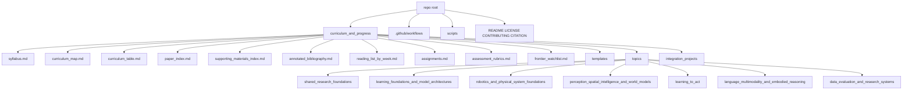
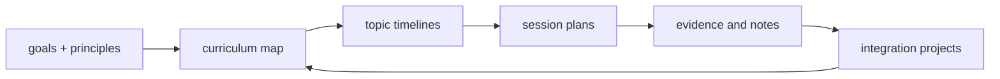
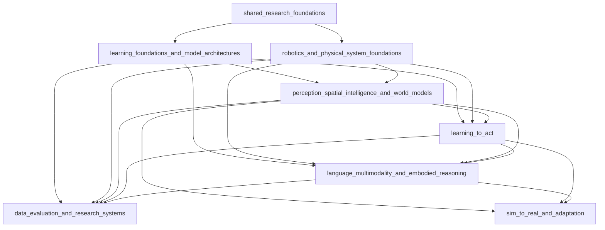
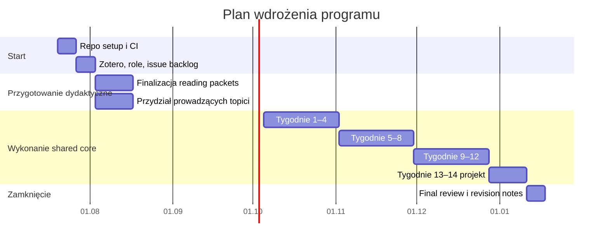

# Program nauczania dla studenckiego klubu badania paperów z robot learning i embodied intelligence

## Streszczenie wykonawcze

Przesłane pliki wejściowe zostały określone precyzyjnie i są wystarczające, aby zbudować spójny, repozytoryjny program nauczania. Cel nie jest „klubem prezentacji paperów”, lecz długofalowym, paper-driven i experiment-centered programem, który ma doprowadzić zespół do samodzielnego rozumienia, budowania, oceniania i rozszerzania inteligentnych systemów działających w świecie fizycznym. Zakres obejmuje sześć dużych obszzarów: fundamenty uczenia i architektur, fundamenty robotyki i układów fizycznych, percepcję i world models, uczenie działania, język i multimodalność w ucieleśnionym rozumowaniu oraz dane, ewaluację i systemy badawcze. Zespół ma już sensowną bazę inżynierską, ale z nierównymi brakami między członkami; dlatego program powinien wzmacniać wspólny rdzeń, a potem rozchodzić się w specjalizacje. fileciteturn0file0L5-L8 fileciteturn0file0L11-L17 fileciteturn0file0L21-L28 fileciteturn0file0L32-L49

Równie ważne są zasady operacyjne: repozytorium ma wspierać model „research apprenticeship”, czyli cykl od fundamentów, przez linię intelektualną paperów, rekonstrukcję matematyki lub architektury, implementację tam, gdzie ma sens, kontrolowaną ewaluację, interpretację systemową i syntezę prowadzącą do własnych pytań badawczych. Same prezentacje paperów nie wystarczą; członkowie mają produkować dowody w postaci notatek rekonstrukcyjnych, implementacji, ablation studies, auditów benchmarków, mini-prototypów badawczych i analiz porażek. fileciteturn0file1L5-L17

Na tej podstawie przyjmuję jedno jawne założenie projektowe: ponieważ dostarczone materiały nie narzucają długości jednego cyklu wykonawczego, ale bardzo mocno rozróżniają długookresową mapę wiedzy od „executable curriculum”, proponuję **14‑tygodniowy semestralny rdzeń wykonawczy**, który jest pierwszą iteracją dłuższego programu wielosemestralnego. To zgodne z tym, że pełna mapa może być szersza niż aktualnie wykonywana część programu, a aktywne, opcjonalne i frontierowe elementy mają być od siebie odróżnione. fileciteturn0file1L20-L29 fileciteturn0file4L17-L30 fileciteturn0file4L97-L107

Dobór literatury opieram na źródłach pierwotnych i oficjalnych: oficjalnych stronach konferencyjnych, arXiv, stronach projektowych oraz oficjalnych dokumentacjach narzędzi. Dla rdzenia programu wybrałem m.in. **Attention Is All You Need**, **CLIP**, **MAE**, **PlaNet**, **DreamerV3**, **NeRF**, **DAgger**, **Decision Transformer**, **Diffusion Policy**, **RT‑1**, **SayCan**, **PaLM‑E**, **RT‑2**, **Open X‑Embodiment**, **Octo**, **OpenVLA**, **DROID** oraz papers o jakości ewaluacji, takie jak **Deep Reinforcement Learning that Matters** i **Deep Reinforcement Learning at the Edge of the Statistical Precipice**. Źródła wspierające fundamenty robotyki pochodzą z oficjalnych materiałów **Modern Robotics**, **Underactuated Robotics** i **Drake**. citeturn1search5turn2academia4turn13search0turn12academia13turn1academia36turn12academia12turn4search5turn3academia27turn3academia24turn14search0turn14academia15turn14academia13turn2academia3turn9search0turn2search0turn2search1turn5search0turn6academia1turn6academia2turn11view0turn10search4turn10search5

Wynik końcowy poniżej jest zorganizowany jako **symulowane repozytorium**. Zachowuję dostarczoną przez użytkownika logikę katalogu `curriculum_and_progress/` oraz rolę plików `curriculum_map.md`, `curriculum_table.md`, `paper_index.md`, `supporting_materials_index.md`, `frontier_watchlist.md`, katalogów tematów i katalogów projektów integracyjnych. Dodaję tylko konwencjonalne pliki repozytoryjne, które nie kolidują z tą strukturą: `README.md`, `LICENSE`, `CONTRIBUTING.md`, `CITATION.cff`, `.github/workflows/`, `scripts/`, a także pliki dydaktyczne takie jak `syllabus.md`, `annotated_bibliography.md`, `assessment_rubrics.md` i `templates/`. To jest świadome rozszerzenie, bo plik struktury repozytorium definiuje miejsca dla artefaktów badawczych, ale nie wyczerpuje metadanych repozytorium ani materiałów oceny dydaktycznej. fileciteturn0file1L44-L50 fileciteturn0file1L70-L80 fileciteturn0file2L17-L27 fileciteturn0file2L54-L99 fileciteturn0file2L101-L149

## Analiza materiałów wejściowych i założenia projektowe

Dostarczone pliki wejściowe w praktyce rozdzielają trzy warstwy pracy. Pierwsza to warstwa normatywna: misja, pytanie przewodnie i model uczenia. Druga to warstwa konstrukcyjna: reguły budowy curriculum, topic timeline i zależności. Trzecia to warstwa repozytoryjna: gdzie trzymać mapę programu, indeks paperów, materiały wspierające, watchlistę i artefakty sesji. To bardzo dobra baza, bo już na wejściu przeciwdziała trzem częstym błędom klubów paperowych: przypadkowemu doborowi tematów, traktowaniu paper sharingu jako celu samego w sobie oraz utracie pamięci instytucjonalnej. fileciteturn0file1L18-L29 fileciteturn0file1L31-L42 fileciteturn0file1L44-L80

Z punktu widzenia konstrukcji programu kluczowe są cztery implikacje. Po pierwsze, trzeba rozróżnić **durable core** od elementów frontierowych i specjalizacyjnych. Po drugie, topic plan ma wynikać z dependency graph, a nie z samej chronologii publikacji. Po trzecie, dla ważnych tematów trzeba zapewnić całą sekwencję: fundamenty, lineage, rekonstrukcję, praktykę, ewaluację i syntezę. Po czwarte, harmonogram między tematami ma być interleaved, ale zależności pozostają nadrzędne. To bezpośrednio uzasadnia moją propozycję: **szeroki curriculum map + ograniczony, 14‑tygodniowy shared core execution plan + aktywny project lane**. fileciteturn0file3L47-L63 fileciteturn0file3L64-L95 fileciteturn0file3L97-L141

Drugie ważne założenie dotyczy zasobów. Materiały wejściowe nie zawierają konkretnych limitów czasu, compute ani sprzętu, choć same zaznaczają, że takie ograniczenia są potrzebne przy budowie master curriculum i topic planów. W odpowiedzi przyjmuję więc **wariant realistyczny dla koła studenckiego**: niski do umiarkowanego budżet obliczeniowy, dominację replikacji małoskalowych i audytów eksperymentalnych, nacisk na źródła otwarte i metody możliwe do zbadania bez frontier-scale training. To jest też zgodne z granicą zapisaną w zasadach: nie należy „imitować frontier-scale model training without a research purpose”. fileciteturn0file1L77-L79 fileciteturn0file3L123-L139 fileciteturn0file1L35-L41

Warto też zaznaczyć, że priorytet źródeł polskojęzycznych jest tutaj ograniczony przez samą naturę dziedziny. Dla fundamentalnej i aktualnej literatury robot learning, world models, VLM/VLA i benchmarkingu praktycznie wszystkie źródła pierwszego wyboru są anglojęzyczne. Dlatego priorytet polski realizuję tak: tam, gdzie jest to rozsądne, dołączam polskojęzyczne komentarze i strukturę dydaktyczną; natomiast właściwe źródła rdzeniowe pozostają oryginalne i oficjalne. To jest metodologicznie lepsze niż zastępowanie paperów wtórnymi skrótami o niższej jakości. citeturn1search5turn12academia13turn1academia36turn14academia13turn2search1

## Podstawa źródłowa i decyzje kuratorskie

Poniższa tabela streszcza kuratorski szkielet programu. Nie jest to pełny indeks paperów — ten znajdzie się dalej w symulowanym repozytorium — ale pokazuje, dlaczego te obszary i właśnie te źródła zostały włączone do wspólnego rdzenia.

| Obszar | Dlaczego w rdzeniu | Reprezentatywne źródła podstawowe |
|---|---|---|
| Architektury i reprezentacje | Transformer, multimodalność i self-supervision są dziś wspólnym językiem dla VLM, VLA i world models. | *Attention Is All You Need*, *CLIP*, *MAE* citeturn1search5turn2academia4turn13search0 |
| Robotyka i systemy fizyczne | Bez kinematyki, dynamiki, estymacji, kontroli i kontaktu nie da się interpretować błędów policy ani ocenić sensowności wyników. | *Modern Robotics*, *Underactuated Robotics*, *Drake* citeturn11view0turn10search4turn10search5 |
| Percepcja przestrzenna i world models | Reprezentacje 3D i modele predykcyjne są pomostem między percepcją, pamięcią i planowaniem. | *NeRF*, *PlaNet*, *DreamerV3*, *World Models* citeturn12academia12turn12academia13turn1academia36turn13academia6 |
| Uczenie działania | Trzeba rozumieć różnice między BC/IL, offline RL, sequence modeling i policy generation. | *DAgger*, *Decision Transformer*, *Diffusion Policy* citeturn4search5turn3academia27turn3academia24 |
| Język, multimodalność i embodied reasoning | To nie tylko „dodanie LLM do robota”, ale problem ugruntowania, planowania i przejścia z semantyki do fizycznie poprawnego działania. | *SayCan*, *PaLM‑E*, *RT‑2* citeturn14academia15turn14academia13turn2academia3 |
| Dane, benchmarki i systemy badawcze | Generalist robot policies rosną na jakości danych i na wiarygodnej ewaluacji. | *Open X‑Embodiment*, *DROID*, *Deep RL that Matters*, *Statistical Precipice*, *rliable* citeturn9search0turn5search0turn6academia1turn6academia2turn7search0 |
| Otwarte polityki generalistyczne | Dają realny punkt wejścia do replikacji, fine-tuningu i porównań przy akademickich zasobach. | *Octo*, *OpenVLA*, *RT‑1* citeturn2search0turn2search1turn14search0 |

Dobór papers nie jest modową listą „najgłośniejszych modeli”. Został zrobiony zgodnie z regułą z przesłanych instrukcji: mają się znaleźć papers fundamentalne, nowoczesne rdzeniowe, krytyczne oraz takie, które odsłaniają ograniczenia, benchmark pitfalls i failure modes. Stąd w rdzeniu umieszczam także papers o metodologii ewaluacji w RL oraz benchmarkingu, bo bez nich klub ryzykuje nadinterpretację wykresów i brak rozróżnienia między poprawą rzeczywistą a artefaktami ustawień eksperymentalnych. fileciteturn0file4L47-L60 fileciteturn0file4L87-L90 citeturn6academia1turn6academia2turn7search0

Wykonalność przy zasobach studenckich poprawiają trzy współczesne zasoby otwarte. **Open X‑Embodiment** agreguje ponad milion trajektorii z 22 embodimentów i 527 umiejętności, stanowiąc naturalny fundament do dyskusji o cross‑embodiment learning. **DROID** otwiera nie tylko dane, ale też setup sprzętowy i workflow zbierania danych. **Octo** i **OpenVLA** dostarczają realnych, otwartych punktów startowych dla polityk generalistycznych, co zmniejsza barierę wejścia między czytaniem paperów a kontrolowaną replikacją. citeturn9search0turn5search0turn2search0turn2search1

Po stronie narzędzi repozytoryjnych proponuję standard bardzo praktyczny. GitHub Actions wymaga plików workflow w `.github/workflows` i pozwala automatyzować walidację repozytorium. GitHub natywnie renderuje diagramy Mermaid w plikach Markdown. Zotero Groups daje współdzieloną bibliotekę z rolami i uprawnieniami. Overleaf zapewnia współredakcję finalnych raportów i posterów. `CITATION.cff` jest wspierany jako czytelny dla ludzi i maszyn format danych cytacyjnych, a GitHub potrafi wyświetlać informacje cytacyjne z tego pliku. citeturn21search2turn21search0turn21search1turn16search0turn16search3turn19search0

## Symulowane repozytorium

Najpierw zachowuję bez zmian dostarczone pliki wejściowe: `1_operating_principles.md`, `2_research_curriculum_goal.md`, `3_research_curriculum_construction_rules.md`, `4_topic_planning_guideline.md`, `5_repo_structure.md`. Poniżej pokazuję **pliki, które należy dodać**, aby repozytorium stało się kompletnym, wykonywalnym programem nauczania. Rzeczywisty układ `curriculum_and_progress/` pozostaje zgodny z oczekiwaniami użytkownika. fileciteturn0file2L21-L52 fileciteturn0file2L54-L99



```text
repo/
├── 1_operating_principles.md
├── 2_research_curriculum_goal.md
├── 3_research_curriculum_construction_rules.md
├── 4_topic_planning_guideline.md
├── 5_repo_structure.md
├── README.md
├── LICENSE
├── CONTRIBUTING.md
├── CITATION.cff
├── .gitignore
├── Makefile
├── .github/
│   └── workflows/
│       └── ci.yml
├── scripts/
│   └── validate_markdown.sh
└── curriculum_and_progress/
    ├── syllabus.md
    ├── weekly_lesson_plans.md
    ├── curriculum_map.md
    ├── curriculum_table.md
    ├── paper_index.md
    ├── supporting_materials_index.md
    ├── annotated_bibliography.md
    ├── reading_list_by_week.md
    ├── assignments.md
    ├── assessment_rubrics.md
    ├── frontier_watchlist.md
    ├── templates/
    │   ├── session_plan_template.md
    │   ├── session_notes_template.md
    │   ├── paper_review_template.md
    │   └── project_plan_template.md
    ├── topics/
    │   ├── shared_research_foundations/
    │   │   ├── topic_plan_and_session_timeline.md
    │   │   ├── 01_critical_reading_and_reconstruction/
    │   │   │   └── session_plan.md
    │   │   └── 02_reliable_evaluation_and_failure_analysis/
    │   │       └── session_plan.md
    │   ├── learning_foundations_and_model_architectures/
    │   │   ├── topic_plan_and_session_timeline.md
    │   │   └── 01_transformers_and_representation_learning/
    │   │       └── session_plan.md
    │   ├── robotics_and_physical_system_foundations/
    │   │   ├── topic_plan_and_session_timeline.md
    │   │   └── 01_kinematics_dynamics_estimation_and_control/
    │   │       └── session_plan.md
    │   ├── perception_spatial_intelligence_and_world_models/
    │   │   ├── topic_plan_and_session_timeline.md
    │   │   ├── 01_spatial_representations_and_3d_worlds/
    │   │   │   └── session_plan.md
    │   │   └── 02_world_models_and_predictive_control/
    │   │       └── session_plan.md
    │   ├── learning_to_act/
    │   │   ├── topic_plan_and_session_timeline.md
    │   │   ├── 01_imitation_learning_and_offline_rl/
    │   │   │   └── session_plan.md
    │   │   └── 02_model_based_and_generative_policies/
    │   │       └── session_plan.md
    │   ├── language_multimodality_and_embodied_reasoning/
    │   │   ├── topic_plan_and_session_timeline.md
    │   │   ├── 01_vlm_grounding_and_planning/
    │   │   │   └── session_plan.md
    │   │   └── 02_vla_models_and_general_robot_control/
    │   │       └── session_plan.md
    │   └── data_evaluation_and_research_systems/
    │       ├── topic_plan_and_session_timeline.md
    │       ├── 01_robot_data_and_dataset_governance/
    │       │   └── session_plan.md
    │       └── 02_benchmarking_reproducibility_and_research_infrastructure/
    │           └── session_plan.md
    └── integration_projects/
        ├── _template/
        │   ├── project_plan.md
        │   ├── linked_topics.md
        │   └── conclusions.md
        └── embodied_pick_and_place_research_cycle/
            ├── project_plan.md
            ├── linked_topics.md
            └── conclusions.md
```

**Ścieżka:** `README.md`
```md
# Golem Robotics Paper Club Curriculum Repository

Repozytorium zawiera trwały program nauczania dla koła paperowego skoncentrowanego na robot learning, physical AI i embodied intelligence.

## Cel repozytorium

Celem jest przejście od „czytania paperów” do powtarzalnego procesu badawczego:
- odtworzenie założeń i mechanizmów metod,
- krytyczna analiza dowodów,
- małoskalowe replikacje i benchmark audits,
- formułowanie własnych pytań badawczych,
- budowanie wspólnej pamięci organizacyjnej.

## Założenie wykonawcze

Repozytorium realizuje 14-tygodniowy wspólny rdzeń semestralny, który może być powtarzany i rozszerzany w kolejnych cyklach. Długookresowa mapa wiedzy pozostaje szersza niż pojedynczy semestr.

## Jak używać repozytorium

1. Przeczytaj pliki `1_...` do `5_...`.
2. Otwórz `curriculum_and_progress/syllabus.md`.
3. Śledź `weekly_lesson_plans.md` i topic timelines.
4. Uzupełniaj artefakty sesji i projektów integracyjnych.
5. Aktualizuj `frontier_watchlist.md` bez destabilizowania rdzenia.

## Mapa repozytorium



## Sugerowane ilustracje do osadzenia w README lub slajdach

- [PLACEHOLDER] Open X-Embodiment overview: https://robotic-transformer-x.github.io/
- [PLACEHOLDER] DROID dataset analysis figures: https://droid-dataset.github.io/
- [PLACEHOLDER] Octo model/results figure: https://octo-models.github.io/
- [PLACEHOLDER] OpenVLA overview figure: https://openvla.github.io/

## Standard narzędziowy

- Git + GitHub do wersjonowania i review.
- GitHub Actions do walidacji Markdown i metadanych cytacyjnych.
- Zotero Groups do współdzielonej bibliografii.
- Overleaf do raportów, posterów i draftów publikacji.
- Mermaid do utrzymywalnych diagramów w Markdown.
```

**Ścieżka:** `LICENSE`
```text
MIT License

Copyright (c) 2026 Golem Robotics Paper Club

Permission is hereby granted, free of charge, to any person obtaining a copy
of this software and associated documentation files (the "Software"), to deal
in the Software without restriction, including without limitation the rights
to use, copy, modify, merge, publish, distribute, sublicense, and/or sell
copies of the Software, and to permit persons to whom the Software is
furnished to do so, subject to the following conditions:

The above copyright notice and this permission notice shall be included in all
copies or substantial portions of the Software.

THE SOFTWARE IS PROVIDED "AS IS", WITHOUT WARRANTY OF ANY KIND, EXPRESS OR
IMPLIED, INCLUDING BUT NOT LIMITED TO THE WARRANTIES OF MERCHANTABILITY,
FITNESS FOR A PARTICULAR PURPOSE AND NONINFRINGEMENT. IN NO EVENT SHALL THE
AUTHORS OR COPYRIGHT HOLDERS BE LIABLE FOR ANY CLAIM, DAMAGES OR OTHER
LIABILITY, WHETHER IN AN ACTION OF CONTRACT, TORT OR OTHERWISE, ARISING FROM,
OUT OF OR IN CONNECTION WITH THE SOFTWARE OR THE USE OR OTHER DEALINGS IN THE
SOFTWARE.

Third-party papers, datasets, figures, documentation and trademarks remain
under their original licenses and terms.
```

**Ścieżka:** `CONTRIBUTING.md`
```md
# Contributing

Dziękujemy za chęć współtworzenia programu.

## Zasady ogólne

Każdy wkład powinien wzmacniać:
- trwały rdzeń wiedzy,
- wiarygodność źródeł,
- odtwarzalność eksperymentów,
- przejrzystość zależności między tematami.

## Co można wnosić

- korekty merytoryczne do topic timelines,
- nowe papers do `frontier_watchlist.md`,
- poprawki metadanych w `paper_index.md`,
- session plans i session notes,
- skrypty replikacyjne i benchmark audits,
- materiały pomocnicze i checklisty.

## Wymagania dla zmian merytorycznych

Każdy pull request powinien zawierać:
1. powód zmiany,
2. wpływ na zależności programu,
3. źródła pierwotne lub oficjalne,
4. status zmiany: rdzeń / aktywny track / specjalizacja / frontier / deferred.

## Styl repozytorium

- nazwy plików i katalogów: `snake_case`,
- opisowe nazwy,
- linki względne między artefaktami,
- brak dużych datasetów i wag modeli w repo,
- dla wyników eksperymentów: instrukcja odtworzenia > binaria.

## Proces review

1. Utwórz branch tematyczny.
2. Dodaj lub zmień plik.
3. Uruchom `make check`.
4. Otwórz PR z krótkim uzasadnieniem.
5. Uzyskaj co najmniej 1 review merytoryczne i 1 review repozytoryjne.

## Minimalna checklista przed merge

- [ ] linki działają,
- [ ] plik ma jasny cel,
- [ ] zmiana nie duplikuje istniejącej zawartości,
- [ ] jeśli dodano paper: ma rolę w curriculum,
- [ ] jeśli zmieniono timeline: zaktualizowano `curriculum_table.md`,
- [ ] jeśli dotyczy projektu: zaktualizowano `linked_topics.md`.
```

**Ścieżka:** `CITATION.cff`
```yaml
cff-version: 1.2.0
message: "Jeśli korzystasz z tego repozytorium lub programu nauczania, cytuj je według poniższych metadanych."
title: "Golem Robotics Paper Club Curriculum for Robot Learning and Embodied Intelligence"
type: software
authors:
  - name: "Golem Robotics Paper Club"
repository-code: "https://github.com/ORG/golem-robotics-paper-club-curriculum"
license: MIT
version: "0.1.0"
date-released: "2026-07-19"
abstract: >
  Repozytorium z programem nauczania dla studenckiego klubu paperowego
  skoncentrowanego na robot learning, world models, multimodal foundation
  models, VLA systems, danych i ewaluacji badań.
keywords:
  - robotics
  - robot learning
  - embodied intelligence
  - world models
  - VLA
  - curriculum
```

**Ścieżka:** `.gitignore`
```gitignore
# OS
.DS_Store
Thumbs.db

# Python
__pycache__/
.venv/
venv/
*.pyc

# Node
node_modules/

# Docs build
site/
dist/
build/

# Editors
.vscode/
.idea/

# Data and outputs
artifacts/
results/
logs/
.cache/
```

**Ścieżka:** `Makefile`
```makefile
.PHONY: help check lint validate-cff validate-md

help:
	@echo "make check         - uruchom pełną walidację repo"
	@echo "make lint          - walidacja markdown"
	@echo "make validate-cff  - walidacja CITATION.cff"
	@echo "make validate-md   - sprawdzenie wymaganych plików"

check: lint validate-cff validate-md

lint:
	npx markdownlint-cli "**/*.md"

validate-cff:
	python -m cffconvert --validate

validate-md:
	bash scripts/validate_markdown.sh
```

**Ścieżka:** `.github/workflows/ci.yml`
```yaml
name: curriculum-ci

on:
  push:
  pull_request:
  workflow_dispatch:

jobs:
  validate:
    runs-on: ubuntu-latest
    steps:
      - name: Checkout
        uses: actions/checkout@v4

      - name: Setup Node
        uses: actions/setup-node@v4
        with:
          node-version: "20"

      - name: Install markdownlint
        run: npm install -g markdownlint-cli

      - name: Setup Python
        uses: actions/setup-python@v5
        with:
          python-version: "3.11"

      - name: Install cffconvert
        run: python -m pip install --upgrade pip cffconvert

      - name: Lint markdown
        run: npx markdownlint-cli "**/*.md"

      - name: Validate citation file
        run: python -m cffconvert --validate

      - name: Validate repository structure
        run: bash scripts/validate_markdown.sh
```

**Ścieżka:** `scripts/validate_markdown.sh`
```bash
#!/usr/bin/env bash
set -euo pipefail

required_files=(
  "README.md"
  "LICENSE"
  "CONTRIBUTING.md"
  "CITATION.cff"
  "curriculum_and_progress/syllabus.md"
  "curriculum_and_progress/curriculum_map.md"
  "curriculum_and_progress/curriculum_table.md"
  "curriculum_and_progress/paper_index.md"
  "curriculum_and_progress/supporting_materials_index.md"
  "curriculum_and_progress/frontier_watchlist.md"
)

for file in "${required_files[@]}"; do
  if [[ ! -f "$file" ]]; then
    echo "Brak wymaganego pliku: $file"
    exit 1
  fi
done

echo "Podstawowa struktura repozytorium jest poprawna."
```

**Ścieżka:** `curriculum_and_progress/syllabus.md`
```md
# Syllabus

## Opis kursu-klubu

To nie jest klasyczny seminar paper club. To iteracyjny program badawczy dla zespołu technicznego, którego celem jest osiągnięcie kompetencji do samodzielnego badania embodied intelligence.

## Efekty uczenia

Po ukończeniu cyklu uczestnik:
1. rekonstruuje założenia i mechanizmy papers z robot learning;
2. odróżnia claims od evidence;
3. projektuje małe, kontrolowane replikacje lub benchmark audits;
4. rozumie zależności między percepcją, reprezentacją, reasoningiem, planowaniem i kontrolą;
5. potrafi zaproponować własne pytanie badawcze w ramach projektu integracyjnego.

## Wymagania wstępne

- Python i podstawy ML/DL,
- podstawy rachunku prawdopodobieństwa i algebry liniowej,
- podstawy robotyki lub gotowość do szybkiego uzupełnienia braków,
- umiejętność czytania literatury anglojęzycznej.

## Format pracy

- 1 spotkanie tygodniowo, 120–150 minut,
- przygotowanie indywidualne przed sesją,
- artefakt pisemny lub eksperymentalny po wybranych sesjach,
- stały projekt integracyjny.

## Ocenianie wewnętrzne

| Składnik | Waga |
|---|---:|
| Mema rekonstrukcyjne paperów | 20% |
| Mini-replikacja / audit benchmarku | 25% |
| Udział merytoryczny i review cudzych prac | 15% |
| Projekt integracyjny | 30% |
| Finalna prezentacja i propozycja badań | 10% |

## Tygodnie

Zob. `weekly_lesson_plans.md` oraz sesje w katalogach tematów.

## Polityka jakości

Prezentacja bez dowodu, rekonstrukcji, porównania albo krytyki nie jest uznawana za pełne zaliczenie sesji rdzeniowej.
```

**Ścieżka:** `curriculum_and_progress/weekly_lesson_plans.md`
```md
# Weekly Lesson Plans

| Tydzień | Główny temat | Plik prowadzący |
|---|---|---|
| 1 | Krytyczne czytanie paperów i rekonstrukcja argumentu | `topics/shared_research_foundations/01_critical_reading_and_reconstruction/session_plan.md` |
| 2 | Rzetelna ewaluacja, niepewność i failure analysis | `topics/shared_research_foundations/02_reliable_evaluation_and_failure_analysis/session_plan.md` |
| 3 | Transformery, self-supervision, reprezentacje | `topics/learning_foundations_and_model_architectures/01_transformers_and_representation_learning/session_plan.md` |
| 4 | Kinematyka, dynamika, estymacja, kontrola | `topics/robotics_and_physical_system_foundations/01_kinematics_dynamics_estimation_and_control/session_plan.md` |
| 5 | Reprezentacje przestrzenne i światy 3D | `topics/perception_spatial_intelligence_and_world_models/01_spatial_representations_and_3d_worlds/session_plan.md` |
| 6 | World models i planowanie predykcyjne | `topics/perception_spatial_intelligence_and_world_models/02_world_models_and_predictive_control/session_plan.md` |
| 7 | Imitation learning i offline RL | `topics/learning_to_act/01_imitation_learning_and_offline_rl/session_plan.md` |
| 8 | Model-based RL i generatywne policies | `topics/learning_to_act/02_model_based_and_generative_policies/session_plan.md` |
| 9 | VLM, grounding i planowanie | `topics/language_multimodality_and_embodied_reasoning/01_vlm_grounding_and_planning/session_plan.md` |
| 10 | VLA i general robot control | `topics/language_multimodality_and_embodied_reasoning/02_vla_models_and_general_robot_control/session_plan.md` |
| 11 | Robot data, teleoperation, governance datasetów | `topics/data_evaluation_and_research_systems/01_robot_data_and_dataset_governance/session_plan.md` |
| 12 | Benchmarking, reproducibility i research infra | `topics/data_evaluation_and_research_systems/02_benchmarking_reproducibility_and_research_infrastructure/session_plan.md` |
| 13 | Sprint projektu integracyjnego | `integration_projects/embodied_pick_and_place_research_cycle/project_plan.md` |
| 14 | Synteza, review projektu, pytania badawcze | `integration_projects/embodied_pick_and_place_research_cycle/conclusions.md` |
```

**Ścieżka:** `curriculum_and_progress/curriculum_map.md`
```md
# Curriculum Map

## Statusy wykonawcze

- Shared Core
- Active Research Track
- Specialization
- Optional
- Frontier Watchlist
- Deferred

## Hierarchia

| Obszar | Topic | Status | Zakres |
|---|---|---|---|
| Shared foundations | shared_research_foundations | Shared Core | czytanie paperów, rekonstrukcja argumentu, evidence, reproducibility |
| Learning foundations | learning_foundations_and_model_architectures | Shared Core | transformery, self-supervision, reprezentacje, multimodal pretraining |
| Robotics foundations | robotics_and_physical_system_foundations | Shared Core | kinematyka, dynamika, estymacja, kontrola, kontakt, bezpieczeństwo |
| Perception and world models | perception_spatial_intelligence_and_world_models | Shared Core | 3D, pamięć, predykcja, latent dynamics, planowanie |
| Learning to act | learning_to_act | Shared Core | imitation, offline RL, model-based RL, generatywne policies |
| Language and multimodality | language_multimodality_and_embodied_reasoning | Shared Core | grounding, VLM, reasoning, planning, VLA |
| Data and systems | data_evaluation_and_research_systems | Shared Core | dane robotyczne, benchmarki, tracking, reproducibility |
| Frontier | generalist_robot_policies_frontier | Frontier Watchlist | pi0/pi0.5, efficiency, transfer beyond lab |
| Frontier | generative_interactive_worlds | Frontier Watchlist | Genie, video world models, synthetic interactive environments |
| Specialization | dexterous_manipulation | Specialization | bimanual, deformables, high-frequency control |
| Specialization | sim_to_real_and_adaptation | Active Research Track | domain shift, adaptation, hardware transfer |

## Global dependency map



## Revision log

| Data | Zmiana | Powód |
|---|---|---|
| 2026-07-19 | Dodano shared core 14 tygodni | wykonawczy pierwszy cykl semestralny |
| 2026-07-19 | Oddzielono frontier od rdzenia | stabilność programu i wykonalność |
```

**Ścieżka:** `curriculum_and_progress/curriculum_table.md`
```md
# Curriculum Table

| Głębokość / Topic | Foundations | Architectures | Robotics | Perception & World Models | Learning to Act | Language & VLA | Data & Systems |
|---|---|---|---|---|---|---|---|
| Wejście | krytyczne czytanie | transformer/self-supervision | kinematyka i estymacja | reprezentacje 3D | BC / DAgger | grounding i VLM | metryki i niepewność |
| Rdzeń | evidence i failure analysis | multimodal pretraining | kontrola i kontakt | PlaNet / NeRF | offline RL / DT | PaLM-E / SayCan | benchmark design |
| Zaawansowane | review pipeline | scaling and alternatives | planning under constraints | Dreamer lineage | diffusion / MBRL | RT-2 / OpenVLA / Octo | data mixture / RLDS / DROID |
| Specjalizacja | meta-analysis | efficient finetuning | safe control | interactive world models | sim-to-real | long-horizon VLA | hardware-in-the-loop |
| Frontier | research writing | new sequence models | dexterity systems | Genie-like models | real-time policy efficiency | pi0 family | dataset governance at scale |
```

**Ścieżka:** `curriculum_and_progress/paper_index.md`
```md
# Paper Index

## shared_research_foundations

| Paper | Rola | Link kanoniczny | Uwaga |
|---|---|---|---|
| Deep Reinforcement Learning that Matters | Critical | https://arxiv.org/abs/1709.06560 | klasyczny paper o wariancji, raportowaniu i reprodukowalności |
| Deep Reinforcement Learning at the Edge of the Statistical Precipice | Modern Core / Critical | https://arxiv.org/abs/2108.13264 | wprowadza profile wydajności i lepsze statystyki agregujące |
| Empirical Design in Reinforcement Learning | Supporting / Modern Core | https://arxiv.org/abs/2304.01315 | praktyczny przewodnik projektowania eksperymentów RL |

## learning_foundations_and_model_architectures

| Paper | Rola | Link kanoniczny | Project / Code | Uwaga |
|---|---|---|---|---|
| Attention Is All You Need | Foundation / Seminal | https://proceedings.neurips.cc/paper/2017/hash/3f5ee243547dee91fbd053c1c4a845aa-Abstract.html | - | wspólny język architektoniczny dla późniejszych modeli sekwencyjnych |
| Learning Transferable Visual Models From Natural Language Supervision | Bridge / Modern Core | https://arxiv.org/abs/2103.00020 | https://github.com/OpenAI/CLIP | łączy skalę danych z transferem reprezentacji |
| Masked Autoencoders Are Scalable Vision Learners | Modern Core | https://openaccess.thecvf.com/content/CVPR2022/html/He_Masked_Autoencoders_Are_Scalable_Vision_Learners_CVPR_2022_paper.html | - | dobry punkt wejścia do self-supervised vision |

## robotics_and_physical_system_foundations

| Źródło | Rola | Link | Uwaga |
|---|---|---|---|
| Modern Robotics | Foundation | https://modernrobotics.northwestern.edu/ | kinematyka, dynamika, planowanie, kontrola, grasping |
| Underactuated Robotics | Foundation / Advanced | https://underactuated.csail.mit.edu/index.html | świetne notatki o dynamice, sterowaniu i planowaniu |
| Drake documentation | Systems | https://drake.mit.edu/ | model-based design, tutoriale i examples |
| Probabilistic Robotics | Foundation | https://robots.stanford.edu/probabilistic-robotics/ | estymacja, niepewność, SLAM, lokalizacja |

## perception_spatial_intelligence_and_world_models

| Paper | Rola | Link kanoniczny | Uwaga |
|---|---|---|---|
| NeRF: Representing Scenes as Neural Radiance Fields for View Synthesis | Bridge | https://arxiv.org/abs/2003.08934 | reprezentacje ciągłe 3D i view synthesis |
| World Models | Foundation | https://arxiv.org/abs/1803.10122 | prosty, historycznie ważny punkt wejścia |
| Learning Latent Dynamics for Planning from Pixels | Seminal | https://arxiv.org/abs/1811.04551 | PlaNet jako wzorzec planowania w latent space |
| Mastering Diverse Domains through World Models | Modern Core | https://arxiv.org/abs/2301.04104 | DreamerV3 jako nowoczesny, generalny punkt odniesienia |

## learning_to_act

| Paper | Rola | Link kanoniczny | Project / Code | Uwaga |
|---|---|---|---|---|
| A Reduction of Imitation Learning and Structured Prediction to No-Regret Online Learning | Foundation | https://arxiv.org/abs/1011.0686 | - | DAgger i problem covariate shift |
| Decision Transformer | Bridge | https://arxiv.org/abs/2106.01345 | - | traktuje RL jako modelowanie sekwencji |
| Diffusion Policy | Modern Core | https://arxiv.org/abs/2303.04137 | https://diffusion-policy.cs.columbia.edu/ | generatywna polityka dla robot manipulation |
| Mastering Diverse Domains through World Models | Cross-reference | https://arxiv.org/abs/2301.04104 | - | MBRL i planowanie przez wyobrażanie trajektorii |

## language_multimodality_and_embodied_reasoning

| Paper | Rola | Link kanoniczny | Project / Code | Uwaga |
|---|---|---|---|---|
| Do As I Can, Not As I Say | Foundation / Bridge | https://arxiv.org/abs/2204.01691 | https://say-can.github.io/ | grounding planowania językowego przez affordances |
| PaLM-E | Modern Core | https://arxiv.org/abs/2303.03378 | - | embodied multimodal language model |
| RT-2 | Modern Core / Synthesis | https://arxiv.org/abs/2307.15818 | - | VLA i transfer wiedzy web -> control |
| RT-1 | Bridge | https://robotics-transformer1.github.io/ | strona projektu zawiera paper i kod | silny, robotyczny punkt odniesienia |
| OpenVLA | Open Systems / Modern Core | https://openvla.github.io/ | projekt + kod | otwarty model VLA do pracy akademickiej |
| Octo | Open Systems / Modern Core | https://octo-models.github.io/ | projekt + kod | otwarta generalist policy o dobrej wykonalności |

## data_evaluation_and_research_systems

| Paper / Resource | Rola | Link kanoniczny | Uwaga |
|---|---|---|---|
| Open X-Embodiment: Robotic Learning Datasets and RT-X Models | Foundation / Systems | https://robotic-transformer-x.github.io/ | standardowy punkt odniesienia dla cross-embodiment data mixtures |
| DROID: A Large-Scale In-the-Wild Robot Manipulation Dataset | Modern Core | https://droid-dataset.github.io/ | dane + dokumentacja sprzętu i workflow |
| rliable | Supporting / Systems | https://github.com/google-research/rliable | biblioteka do wiarygodnej ewaluacji benchmarków |
| RLDS | Supporting / Systems | https://github.com/google-research/rlds | standard i narzędzia dla datasetów sekwencyjnych |
```

**Ścieżka:** `curriculum_and_progress/supporting_materials_index.md`
```md
# Supporting Materials Index

| Materiał | Typ | Link | Rola w programie |
|---|---|---|---|
| Modern Robotics | book + videos | https://modernrobotics.northwestern.edu/ | kinematyka, pojęcia przestrzenne, trajektorie, kontrola |
| Underactuated Robotics | lecture notes | https://underactuated.csail.mit.edu/index.html | dynamika, sterowanie optymalne, kontakt, planowanie |
| Drake | docs + tutorials | https://drake.mit.edu/ | środowisko do model-based robotics i planning |
| Probabilistic Robotics | book support page | https://robots.stanford.edu/probabilistic-robotics/ | estymacja, lokalizacja, filtracja, mapowanie |
| Zotero Groups docs | documentation | https://www.zotero.org/support/groups | organizacja bibliografii zespołowej |
| GitHub Actions docs | documentation | https://docs.github.com/en/actions/reference/workflows-and-actions | CI dla repozytorium |
| GitHub diagrams docs | documentation | https://docs.github.com/en/get-started/writing-on-github/working-with-advanced-formatting/creating-diagrams | Mermaid w Markdown |
| Citation File Format | documentation | https://github.com/citation-file-format/citation-file-format | metadane cytacyjne repo |
| Mermaid docs | documentation | https://mermaid.js.org/intro/ | utrzymywalne diagramy w Markdown |
```

**Ścieżka:** `curriculum_and_progress/annotated_bibliography.md`
```md
# Annotated Bibliography

## Rdzeń wspólny

### Attention Is All You Need
Link: https://proceedings.neurips.cc/paper/2017/hash/3f5ee243547dee91fbd053c1c4a845aa-Abstract.html  
To paper, który daje wspólny aparat pojęciowy dla sekwencji, attention i późniejszych modeli multimodalnych. W curriculum pełni funkcję „lingua franca”: nie dlatego, że wszystko jest transformerem, lecz dlatego, że bez tego paperu trudno krytycznie czytać późniejsze VLM/VLA i sequence-modeling w RL.

### Deep Reinforcement Learning that Matters
Link: https://arxiv.org/abs/1709.06560  
Kluczowy paper anty-naïve: pokazuje, że w RL małe zmiany implementacyjne, liczba seedów i sposób raportowania potrafią całkowicie zmienić interpretację wyników. Powinien być czytany wcześnie, zanim klub zacznie ufać samym wykresom sukcesu.

### Deep Reinforcement Learning at the Edge of the Statistical Precipice
Link: https://arxiv.org/abs/2108.13264  
Rozszerza krytykę wcześniejszej praktyki ewaluacyjnej. Daje konkretne narzędzia: interquartile mean, performance profiles i przedziały ufności. W klubie to paper obowiązkowy do audytu cudzych benchmarków.

### Learning Latent Dynamics for Planning from Pixels
Link: https://arxiv.org/abs/1811.04551  
PlaNet jest dobrym wejściem do world models, bo ma czytelną architekturę, mocny cel i jasną relację między modelem świata a planowaniem. To jeden z najlepszych paperów do rekonstrukcji „jak dokładnie planowanie przechodzi przez latent model”.

### Mastering Diverse Domains through World Models
Link: https://arxiv.org/abs/2301.04104  
DreamerV3 to nowoczesny punkt odniesienia dla world-model RL. Ważny nie tylko wynikowo, ale też jako przykład systemowego dopracowania stabilności treningu i uogólnienia między domenami.

### Diffusion Policy
Link: https://arxiv.org/abs/2303.04137  
Wprowadza bardzo ważną dla robot learning intuicję: multimodalność akcji można modelować generatywnie, a nie tylko jedną średnią deterministyczną polityką. Dobry paper do porównania z behavior cloning i offline methods.

### Do As I Can, Not As I Say
Link: https://arxiv.org/abs/2204.01691  
Papier o grounding language przez affordances, a nie przez czyste generowanie planów. Dobry pomost między klasycznym planowaniem, skill libraries i współczesnym LLM/VLM-for-robotics hype.

### PaLM-E
Link: https://arxiv.org/abs/2303.03378  
Jedna z najważniejszych prac o embodied multimodal language models. Warto czytać krytycznie: nie tylko „co działa”, ale jakie reprezentacje i interfejsy między światem fizycznym a tokenowym są tu naprawdę założone.

### RT-2
Link: https://arxiv.org/abs/2307.15818  
Silny paper syntetyczny: pokazuje, jak web-scale vision-language knowledge może wspierać robota. Czytać razem z pytaniem: gdzie kończy się semantyczne uogólnienie, a zaczynają ograniczenia embodied control.

### Open X-Embodiment
Link: https://robotic-transformer-x.github.io/  
Nie tylko dataset, ale argument za cross-embodiment learning. Ważny dla zrozumienia, że „foundation model for robotics” zależy od standaryzacji danych i spójnego action interface, a nie wyłącznie od architektury.
```

**Ścieżka:** `curriculum_and_progress/reading_list_by_week.md`
```md
# Reading List by Week

| Tydzień | Obowiązkowe | Zalecane |
|---|---|---|
| 1 | Deep RL that Matters | Empirical Design in RL |
| 2 | Statistical Precipice | rliable README |
| 3 | Attention Is All You Need; CLIP; MAE | wybrane sekcje o scalingu |
| 4 | Modern Robotics: ch. 2–5, 8, 11 | Underactuated: rozdziały o dynamice i kontroli |
| 5 | NeRF | Probabilistic Robotics: estymacja i reprezentacje |
| 6 | World Models; PlaNet; DreamerV3 | Genie jako background frontier |
| 7 | DAgger; Decision Transformer | wybrane porównania offline RL |
| 8 | Diffusion Policy; DreamerV3 (powtórka) | dodatkowe porównania generatywnych policy |
| 9 | SayCan; PaLM-E | RT-1 jako most do robot-specific control |
| 10 | RT-2; OpenVLA; Octo | Open X-Embodiment (sekcje o RT-X) |
| 11 | Open X-Embodiment; DROID | RLDS docs |
| 12 | rliable; Empirical Design in RL | GitHub Actions + CI for research repos |
| 13 | Linked topic readings per project | dodatkowe papers specjalizacyjne |
| 14 | własne propozycje badań + top 3 papers projektu | frontier watchlist |
```

**Ścieżka:** `curriculum_and_progress/assignments.md`
```md
# Assignments

## Assignment A
### Memo rekonstrukcyjne paperu
- Termin: tydzień 2
- Długość: 2–3 strony
- Cel: odtworzyć problem, założenia, mechanizm, evidence i ukryte zależności paperu.
- Artefakt: standard wg `templates/paper_review_template.md`

## Assignment B
### Mini-replikacja lub benchmark audit
- Termin: tydzień 8
- Długość: repo + 2 strony notatki
- Cel: odtworzyć jeden element paperu lub wykazać, że porównanie benchmarkowe jest wrażliwe na ustawienia.
- Oczekiwane elementy: baseline, kontrola zmiennych, metryki, ograniczenia.

## Assignment C
### Karta mapy zależności topicu
- Termin: tydzień 10
- Długość: 1 diagram + 1 strona komentarza
- Cel: pokazać związek między reprezentacją, planowaniem, danymi i kontrolą w obrębie wybranego topicu.

## Assignment D
### Projekt integracyjny
- Termin: tydzień 14
- Artefakty:
  - `project_plan.md`,
  - `linked_topics.md`,
  - wynik eksperymentalny lub audyt,
  - finalna prezentacja 8–10 minut.
```

**Ścieżka:** `curriculum_and_progress/assessment_rubrics.md`
```md
# Assessment Rubrics

## Rubryka dla memo rekonstrukcyjnego

| Kryterium | 1 | 3 | 5 |
|---|---|---|---|
| Problem i motywacja | streszczenie powierzchowne | poprawne, lecz bez kontekstu | jasne osadzenie w linii badań |
| Rekonstrukcja mechanizmu | brak lub błędy | częściowo poprawna | precyzyjna i technicznie rzetelna |
| Evidence i metryki | bez analizy | podstawowa analiza | krytyczna analiza z ograniczeniami |
| Ograniczenia | brak | kilka ograniczeń | ograniczenia + konsekwencje badawcze |
| Język techniczny | nieprecyzyjny | poprawny | bardzo precyzyjny i zwięzły |

## Rubryka dla mini-replikacji / audytu

| Kryterium | 1 | 3 | 5 |
|---|---|---|---|
| Definicja pytania | niejasna | poprawna | dobrze zawężona i testowalna |
| Kontrola eksperymentu | słaba | częściowa | kontrolowana i porównywalna |
| Odtwarzalność | brak instrukcji | częściowa | pełna, z seedami i konfiguracją |
| Interpretacja wyników | opisowa | umiarkowanie krytyczna | krytyczna, z wyjaśnieniem failure cases |
| Repo quality | chaotyczne | poprawne | czyste, dobrze nazwane, czytelne |

## Rubryka dla projektu integracyjnego

| Kryterium | 1 | 3 | 5 |
|---|---|---|---|
| Integracja topiców | pojedynczy topic | 2 topici | 3+ topici w jednej hipotezie |
| Jakość pytania badawczego | modne, nieostre | sensowne | ostre, wykonalne, falsyfikowalne |
| Evidence | słabe | umiarkowane | przekonujące lub dobrze ograniczone |
| Krytyka własna | brak | częściowa | dojrzała analiza luk i next steps |
| Komunikacja techniczna | nieczytelna | zrozumiała | klarowna i profesjonalna |
```

**Ścieżka:** `curriculum_and_progress/frontier_watchlist.md`
```md
# Frontier Watchlist

| Pozycja | Data dodania | Powiązany topic | Dlaczego ważne | Status |
|---|---|---|---|---|
| pi0 | 2026-07-19 | language_multimodality_and_embodied_reasoning | generalist policy z mocnym naciskiem na zręczność i flow matching | monitor |
| pi0.5 | 2026-07-19 | language_multimodality_and_embodied_reasoning | open-world generalization i praca poza labem | monitor |
| Genie | 2026-07-19 | perception_spatial_intelligence_and_world_models | generative interactive environments jako nowa klasa world models | monitor |
| OXE-AugE | 2026-07-19 | data_evaluation_and_research_systems | skala cross-embodiment augmentation | monitor |
| A1 VLA | 2026-07-19 | language_multimodality_and_embodied_reasoning | nacisk na koszt inferencji i transparentność stacku | monitor |
| VLAFlow | 2026-07-19 | learning_to_act | uporządkowane porównanie paradygmatów pretrainingu VLA | monitor |
```

**Ścieżka:** `curriculum_and_progress/templates/session_plan_template.md`
```md
# Session Plan Template

## Tytuł sesji

## Pytanie przewodnie

## Miejsce w topic timeline

## Warunki wstępne

## Materiały obowiązkowe

## Materiały pomocnicze

## Agenda spotkania

## Oczekiwane artefakty

## Zadanie po sesji

## Kryterium uznania sesji za zamkniętą
```

**Ścieżka:** `curriculum_and_progress/templates/session_notes_template.md`
```md
# Session Notes Template

## Co zostało ustalone

## Jakie dowody omówiono

## Co było niejasne lub zawodne

## Wyniki części praktycznej

## Otwarta lista pytań

## Decyzja o kolejnym kroku
```

**Ścieżka:** `curriculum_and_progress/templates/paper_review_template.md`
```md
# Paper Review Template

## Bibliografia

## Problem i teza paperu

## Założenia

## Mechanizm / architektura / matematyka

## Evidence

## Ukryte zależności
- dane
- compute
- benchmark
- hardware
- implementation details

## Ograniczenia

## Relacja do wcześniejszych i późniejszych prac

## Co warto byłoby sprawdzić replikacyjnie
```

**Ścieżka:** `curriculum_and_progress/templates/project_plan_template.md`
```md
# Project Plan Template

## Pytanie badawcze

## Hipoteza

## Powiązane topici

## Dane i zasoby

## Metoda

## Metryki i kryteria sukcesu

## Ryzyka

## Artefakty końcowe

## Minimalna wersja projektu

## Wersja ambitna
```

**Ścieżka:** `curriculum_and_progress/topics/shared_research_foundations/topic_plan_and_session_timeline.md`
```md
# Topic Plan and Session Timeline

## Zakres i głębokość
Topic obejmuje krytyczne czytanie paperów, rekonstrukcję argumentu, podstawy reprodukowalności, metryki jakości dowodu i failure analysis.

## Status i granica ukończenia
Status: Shared Core  
Granica ukończenia: uczestnik umie przeprowadzić paper audit bez redukowania go do streszczenia.

## Zależności
Brak formalnych prerekwizytów; to topic wejściowy.

## Concept map
reading -> reconstruction -> evidence -> uncertainty -> failure analysis -> reproducibility

## Sesje
1. Critical reading and reconstruction — required core  
2. Reliable evaluation and failure analysis — required core  
3. Scientific communication and literature review workflow — optional continuation

## Cross-topic links
Ten topic zasila wszystkie pozostałe.

## Coverage check
Pokrywa model uczenia: foundations -> evidence analysis -> synthesis.
```

**Ścieżka:** `curriculum_and_progress/topics/shared_research_foundations/01_critical_reading_and_reconstruction/session_plan.md`
```md
# Sesja 01 — Krytyczne czytanie paperów i rekonstrukcja argumentu

## Pytanie przewodnie
Jak odzyskać z paperu rzeczywisty wkład, a nie tylko narrację autorów?

## Materiały obowiązkowe
- Deep Reinforcement Learning that Matters
- fragment `curriculum_and_progress/annotated_bibliography.md`

## Agenda
1. Rozbicie paperu na: problem, założenia, mechanizm, evidence.
2. Wspólna analiza jednego wykresu i jednego porównania baseline.
3. Ćwiczenie: „co paper zakłada, ale nie mówi wprost?”
4. Zdefiniowanie formatu memo rekonstrukcyjnego.

## Oczekiwany artefakt
Krótka karta rekonstrukcyjna jednego paperu z rdzenia.

## Zadanie po sesji
Wypełnij `templates/paper_review_template.md` dla wybranego paperu.
```

**Ścieżka:** `curriculum_and_progress/topics/shared_research_foundations/02_reliable_evaluation_and_failure_analysis/session_plan.md`
```md
# Sesja 02 — Rzetelna ewaluacja, niepewność i failure analysis

## Pytanie przewodnie
Kiedy benchmark naprawdę pokazuje postęp, a kiedy tylko szum lub artefakt eksperymentalny?

## Materiały obowiązkowe
- Deep Reinforcement Learning at the Edge of the Statistical Precipice
- rliable README
- Empirical Design in Reinforcement Learning

## Agenda
1. Mean vs median vs IQM.
2. Performance profiles i przedziały ufności.
3. Jak czytać seed sensitivity i asteriski przy tabelach.
4. Mini-audit opublikowanego benchmarku.

## Oczekiwany artefakt
Jednostronicowy audit porównania eksperymentalnego.

## Zadanie po sesji
Przygotuj szkic Assignment B: co będziesz replikować lub audytować.
```

**Ścieżka:** `curriculum_and_progress/topics/learning_foundations_and_model_architectures/topic_plan_and_session_timeline.md`
```md
# Topic Plan and Session Timeline

## Zakres i głębokość
Transformery, attention, multimodal pretraining, self-supervision, reprezentacje przenoszalne.

## Status i granica ukończenia
Status: Shared Core  
Granica ukończenia: uczestnik potrafi wyjaśnić, jak architektura i objective kształtują reprezentację oraz downstream generalization.

## Zależności
- shared_research_foundations

## Sesje
1. Transformers and representation learning — required core
2. Scaling, transfer and multimodal pretraining — advanced continuation
3. Efficient finetuning and open-model adaptation — optional specialization

## Coverage check
Topic dostarcza pojęciowy język dla VLM, VLA, world models i sequence-modeling w RL.
```

**Ścieżka:** `curriculum_and_progress/topics/learning_foundations_and_model_architectures/01_transformers_and_representation_learning/session_plan.md`
```md
# Sesja 03 — Transformery, self-supervision i reprezentacje

## Pytanie przewodnie
Jak objective pretrainingu zmienia to, co model „wie” o świecie i co może przenieść na robotykę?

## Materiały obowiązkowe
- Attention Is All You Need
- CLIP
- MAE

## Agenda
1. Attention, tokenizacja i inductive bias.
2. Kontrast między contrastive a reconstruction-based self-supervision.
3. Co z tych idei realnie przenosi się do embodied AI?
4. Debata: reprezentacja ogólna vs robot-specific control backbone.

## Oczekiwany artefakt
Tabela porównawcza objectives i typów transferu.
```

**Ścieżka:** `curriculum_and_progress/topics/robotics_and_physical_system_foundations/topic_plan_and_session_timeline.md`
```md
# Topic Plan and Session Timeline

## Zakres i głębokość
Kinematyka, dynamika, estymacja, sprzężenie zwrotne, ograniczenia czasowe, kontakt i bezpieczeństwo na poziomie potrzebnym do oceny learned systems.

## Status i granica ukończenia
Status: Shared Core  
Granica ukończenia: uczestnik potrafi odróżnić błąd reprezentacji od błędu sterowania, estymacji lub kontaktu.

## Zależności
- shared_research_foundations

## Sesje
1. Kinematics, dynamics, estimation and control — required core
2. Contact, planning and safety — advanced continuation
3. Hardware-aware evaluation — optional specialization
```

**Ścieżka:** `curriculum_and_progress/topics/robotics_and_physical_system_foundations/01_kinematics_dynamics_estimation_and_control/session_plan.md`
```md
# Sesja 04 — Kinematyka, dynamika, estymacja i kontrola

## Pytanie przewodnie
Jakie klasyczne ograniczenia fizyczne i sterownicze decydują o tym, czy learned policy ma sens poza benchmarkiem?

## Materiały obowiązkowe
- Modern Robotics: rozdziały o kinematyce i kontroli
- Underactuated Robotics: wybrane notatki o dynamice

## Agenda
1. Frames, twists, Jacobians.
2. Dynamika i ograniczenia aktuacji.
3. Estymacja stanu i opóźnienia.
4. Krótkie studium przypadku: policy działa w symulacji, nie działa na robocie — gdzie szukać przyczyny?

## Oczekiwany artefakt
Lista „physical sanity checks” dla późniejszych sesji.
```

**Ścieżka:** `curriculum_and_progress/topics/perception_spatial_intelligence_and_world_models/topic_plan_and_session_timeline.md`
```md
# Topic Plan and Session Timeline

## Zakres i głębokość
Reprezentacje wizualne, 3D i temporalne, pamięć, latent dynamics, world models, predykcja i planowanie.

## Status i granica ukończenia
Status: Shared Core  
Granica ukończenia: uczestnik rozumie różnicę między reprezentacją sceny, modelem dynamiki i plannerem.

## Zależności
- learning_foundations_and_model_architectures
- robotics_and_physical_system_foundations

## Sesje
1. Spatial representations and 3D worlds — required core
2. World models and predictive control — required core
3. Interactive generative environments — frontier continuation
```

**Ścieżka:** `curriculum_and_progress/topics/perception_spatial_intelligence_and_world_models/01_spatial_representations_and_3d_worlds/session_plan.md`
```md
# Sesja 05 — Reprezentacje przestrzenne i światy 3D

## Pytanie przewodnie
Jak model reprezentuje przestrzeń tak, aby była użyteczna dla pamięci, planowania i manipulacji?

## Materiały obowiązkowe
- NeRF
- wybrane fragmenty Probabilistic Robotics

## Agenda
1. Czym jest reprezentacja przestrzenna „wystarczająca” dla działania.
2. Mapy, poses, trajectories, continuous scene functions.
3. Gdzie NeRF pomaga, a gdzie nie rozwiązuje problemu sterowania.
4. Związek reprezentacji 3D z downstream policy learning.

## Oczekiwany artefakt
Mapa pojęć: scena, stan, pamięć, obserwacja, latent.
```

**Ścieżka:** `curriculum_and_progress/topics/perception_spatial_intelligence_and_world_models/02_world_models_and_predictive_control/session_plan.md`
```md
# Sesja 06 — World models i planowanie predykcyjne

## Pytanie przewodnie
Kiedy model świata naprawdę wspiera działanie, a kiedy jest tylko elegancką warstwą pośrednią?

## Materiały obowiązkowe
- World Models
- PlaNet
- DreamerV3

## Agenda
1. Reprezentacja kompaktowa vs zadaniowo istotna.
2. Planning in latent space.
3. Dreamer lineage: co się zmieniło od wczesnych prac.
4. Dyskusja: world model jako planner, memory czy value-support?

## Oczekiwany artefakt
Porównanie trzech papers: objective, planner, evidence, failure modes.
```

**Ścieżka:** `curriculum_and_progress/topics/learning_to_act/topic_plan_and_session_timeline.md`
```md
# Topic Plan and Session Timeline

## Zakres i głębokość
Imitation learning, offline RL, model-based RL, reward/preference learning, generatywne policies i sim-to-real.

## Status i granica ukończenia
Status: Shared Core  
Granica ukończenia: uczestnik potrafi dobrać paradygmat uczenia do typu danych i problemu.

## Zależności
- learning_foundations_and_model_architectures
- robotics_and_physical_system_foundations
- perception_spatial_intelligence_and_world_models

## Sesje
1. Imitation learning and offline RL — required core
2. Model-based and generative policies — required core
3. Sim-to-real adaptation — active research track
```

**Ścieżka:** `curriculum_and_progress/topics/learning_to_act/01_imitation_learning_and_offline_rl/session_plan.md`
```md
# Sesja 07 — Imitation learning i offline RL

## Pytanie przewodnie
Co dokładnie zyskujemy, a co tracimy, kiedy uczymy się z demonstracji zamiast eksplorować środowisko?

## Materiały obowiązkowe
- DAgger
- Decision Transformer

## Agenda
1. Covariate shift i dataset aggregation.
2. RL jako sequence modeling: co upraszcza, a co ukrywa.
3. Kiedy offline data wystarcza, a kiedy nie.
4. Mini-case: która metoda lepsza dla małego zespołu i dlaczego?

## Oczekiwany artefakt
Krótka decyzja metodyczna dla hipotetycznego projektu robota stołowego.
```

**Ścieżka:** `curriculum_and_progress/topics/learning_to_act/02_model_based_and_generative_policies/session_plan.md`
```md
# Sesja 08 — Model-based RL i generatywne policies

## Pytanie przewodnie
Czy polityka powinna przewidywać „następną akcję”, czy raczej modelować rozkład dobrych trajektorii?

## Materiały obowiązkowe
- Diffusion Policy
- DreamerV3 (powrót)
- wybrane wyniki porównawcze

## Agenda
1. Diffusion as policy representation.
2. Receding horizon, multimodalność akcji, stabilność treningu.
3. Porównanie do sequence modeling i latent planning.
4. Co jest praktycznie wykonalne w warunkach koła studenckiego.

## Oczekiwany artefakt
Szkic Assignment B lub propozycja projektu integracyjnego.
```

**Ścieżka:** `curriculum_and_progress/topics/language_multimodality_and_embodied_reasoning/topic_plan_and_session_timeline.md`
```md
# Topic Plan and Session Timeline

## Zakres i głębokość
Grounding, VLM, embodied reasoning, planning, memory, mapping language -> action, VLA.

## Status i granica ukończenia
Status: Shared Core  
Granica ukończenia: uczestnik rozumie różnicę między modelem rozumującym o zadaniu a modelem wykonującym sterowanie.

## Zależności
- learning_foundations_and_model_architectures
- robotics_and_physical_system_foundations
- perception_spatial_intelligence_and_world_models
- learning_to_act

## Sesje
1. VLM grounding and planning — required core
2. VLA models and general robot control — required core
3. Open-world generalization beyond lab — frontier continuation
```

**Ścieżka:** `curriculum_and_progress/topics/language_multimodality_and_embodied_reasoning/01_vlm_grounding_and_planning/session_plan.md`
```md
# Sesja 09 — VLM, grounding i planowanie

## Pytanie przewodnie
Jak przejść od wiedzy semantycznej do fizycznie wykonalnego planu?

## Materiały obowiązkowe
- Do As I Can, Not As I Say
- PaLM-E

## Agenda
1. Grounding przez affordances vs end-to-end co-training.
2. Co dokładnie jest „ucieleśnione” w embodied language model.
3. Gdzie kończy się planowanie symboliczne, a zaczyna policy execution.
4. Dyskusja o pamięci, narzędziach i planach wieloetapowych.

## Oczekiwany artefakt
Jednostronicowy diagram przepływu: instruction -> percept -> plan -> action.
```

**Ścieżka:** `curriculum_and_progress/topics/language_multimodality_and_embodied_reasoning/02_vla_models_and_general_robot_control/session_plan.md`
```md
# Sesja 10 — VLA i general robot control

## Pytanie przewodnie
Czy VLA jest rzeczywistym punktem syntezy, czy tylko wygodnym interfejsem marketingowym dla różnych problemów naraz?

## Materiały obowiązkowe
- RT-2
- RT-1
- OpenVLA
- Octo
- Open X-Embodiment (sekcje modelowe)

## Agenda
1. RT-1 vs RT-2 vs OpenVLA vs Octo.
2. Otwarty stack vs zamknięte systemy.
3. Dane, action space i embodiment mismatch.
4. Który model jest najlepszym kandydatem do studenckiej repliki?

## Oczekiwany artefakt
Tabela porównawcza czterech rodzin modeli.
```

**Ścieżka:** `curriculum_and_progress/topics/data_evaluation_and_research_systems/topic_plan_and_session_timeline.md`
```md
# Topic Plan and Session Timeline

## Zakres i głębokość
Zbieranie danych robotycznych, teleoperation, dataset design, benchmarki, tracking eksperymentów, reproducibility, hardware-in-the-loop.

## Status i granica ukończenia
Status: Shared Core  
Granica ukończenia: uczestnik umie ocenić jakość pipeline’u badawczego, a nie tylko modelu.

## Zależności
Wszystkie wcześniejsze topici.

## Sesje
1. Robot data and dataset governance — required core
2. Benchmarking, reproducibility and research infrastructure — required core
3. Hardware-in-the-loop and lab protocol — active research track
```

**Ścieżka:** `curriculum_and_progress/topics/data_evaluation_and_research_systems/01_robot_data_and_dataset_governance/session_plan.md`
```md
# Sesja 11 — Robot data, teleoperation i governance datasetów

## Pytanie przewodnie
Jakie własności datasetu decydują o tym, czy generalizacja robota jest rzeczywista?

## Materiały obowiązkowe
- Open X-Embodiment
- DROID
- RLDS docs

## Agenda
1. Heterogeniczność embodimentów.
2. Teleoperation, annotacje, scene diversity.
3. Co znaczy „dataset quality” dla robot manipulation.
4. Jak zaprojektować mały lokalny dataset, żeby miał sens badawczy.

## Oczekiwany artefakt
Projekt minimalnego local data collection protocol.
```

**Ścieżka:** `curriculum_and_progress/topics/data_evaluation_and_research_systems/02_benchmarking_reproducibility_and_research_infrastructure/session_plan.md`
```md
# Sesja 12 — Benchmarking, reproducibility i research infrastructure

## Pytanie przewodnie
Jak zbudować repozytorium badawcze, które nie gubi kontekstu eksperymentów i pozwala wrócić do wyniku za miesiąc?

## Materiały obowiązkowe
- rliable
- Empirical Design in RL
- GitHub Actions docs
- Zotero Groups docs

## Agenda
1. Benchmark hygiene.
2. Struktura repo do badań.
3. CI dla Markdown, metadanych i checklist eksperymentów.
4. Bibliografia grupowa i workflow review.

## Oczekiwany artefakt
Gotowy plan infrastrukturalny dla projektu integracyjnego.
```

**Ścieżka:** `curriculum_and_progress/integration_projects/_template/project_plan.md`
```md
# Project Plan Template

## Pytanie badawcze

## Hipoteza

## Powiązane topici

## Metoda

## Dane

## Metryki

## Artefakty repo

## Ryzyka

## Plan minimum

## Plan ambitny
```

**Ścieżka:** `curriculum_and_progress/integration_projects/_template/linked_topics.md`
```md
# Linked Topics Template

| Topic | Co wnosi | Jak zostanie użyty |
|---|---|---|
|  |  |  |
```

**Ścieżka:** `curriculum_and_progress/integration_projects/_template/conclusions.md`
```md
# Conclusions Template

## Co zadziałało

## Co nie zadziałało

## Jakie są ograniczenia wyniku

## Jakie są dalsze pytania badawcze

## Jak to wpływa na curriculum
```

**Ścieżka:** `curriculum_and_progress/integration_projects/embodied_pick_and_place_research_cycle/project_plan.md`
```md
# Project Plan

## Pytanie badawcze
Czy lekka, otwarta polityka language-conditioned, zasilona małym mieszanym zbiorem demonstracji i prostym protokołem audytu benchmarku, poprawi generalizację tabletop pick-and-place wobec baseline’u behavior cloning?

## Hipoteza
Model z lepszą reprezentacją multimodalną i krytycznie zdefiniowanym protokołem oceny pokaże stabilniejszą generalizację niż prosty baseline BC, ale główny zysk będzie zależeć od jakości danych i definicji sukcesu.

## Powiązane topici
- learning foundations,
- robotics foundations,
- perception/world models,
- learning to act,
- language/VLA,
- data/evaluation.

## Artefakty
- katalog eksperymentów,
- protokół danych,
- audit benchmarku,
- raport końcowy,
- rekomendacje zmian curriculum.

## Plan minimum
- porównanie 2 policy families,
- 1 zadanie tabletop,
- 1 protokół OOD,
- 1 analiza porażek.

## Plan ambitny
- dwa roboty lub dwa action spaces,
- world-model-assisted analysis,
- rozszerzenie do małego projektu semestralnego.
```

**Ścieżka:** `curriculum_and_progress/integration_projects/embodied_pick_and_place_research_cycle/linked_topics.md`
```md
# Linked Topics

| Topic | Wkład do projektu | Konkretny artefakt |
|---|---|---|
| shared_research_foundations | kryteria oceny evidence | audit benchmarku |
| learning_foundations_and_model_architectures | wybór backbone i objective | memo wyboru modelu |
| robotics_and_physical_system_foundations | sanity checks dla sterowania | lista ograniczeń fizycznych |
| perception_spatial_intelligence_and_world_models | reprezentacja obserwacji | decyzja o wejściu modelu |
| learning_to_act | baseline BC vs policy generatywna | protokół porównawczy |
| language_multimodality_and_embodied_reasoning | language-conditioning | format instrukcji |
| data_evaluation_and_research_systems | metryki, seedy, logging | reproducibility checklist |
```

**Ścieżka:** `curriculum_and_progress/integration_projects/embodied_pick_and_place_research_cycle/conclusions.md`
```md
# Conclusions

## Status
Plik startowy do wypełnienia po tygodniu 14.

## Minimalne pytania końcowe
1. Czy poprawa była stabilna między seedami?
2. Czy sukces był rzeczywisty czy zależny od definicji metryki?
3. Czy błędy były reprezentacyjne, sterownicze, czy danych?
4. Co powinno wrócić do `frontier_watchlist.md`, a co do rdzenia programu?
```

Powyższe artefakty są zbudowane wokół oficjalnych i pierwotnych źródeł: Transformera z oficjalnych proceedings NeurIPS, MAE z CVPR Open Access, CLIP z arXiv, DreamerV3 i PlaNet z arXiv, RT‑1 i Open X‑Embodiment z oficjalnych stron projektowych, RT‑2/PaLM‑E/SayCan/Diffusion Policy z oryginalnych preprintów, a OpenVLA, Octo i DROID — z ich oficjalnych project pages i dokumentacji. citeturn1search5turn13search0turn2academia4turn12academia13turn1academia36turn14search0turn9search0turn2academia3turn14academia13turn14academia15turn3academia24turn2search1turn2search0turn5search0

## Walidacja celu i macierz pokrycia

Pytanie przewodnie z dostarczonego dokumentu brzmi: **jaką wiedzę, praktykę eksperymentalną i kompetencję systemową zespół musi rozwinąć, aby samodzielnie badać i rozwijać maszyny, które percepują, reprezentują, rozumują, uczą się, planują i działają w świecie fizycznym**. Poniżej sprawdzam, czy zaproponowany program rzeczywiście to pokrywa. fileciteturn0file0L21-L28 fileciteturn0file0L50-L52

| Cel / pytanie z dokumentu wejściowego | Materiały w repo | Aktywności | Status |
|---|---|---|---|
| Rekonstrukcja założeń, matematyki, architektury i evidence | `paper_index.md`, `annotated_bibliography.md`, sesje 1–3 | memo rekonstrukcyjne | pokryte |
| Krytyczne czytanie i odróżnianie claims od evidence | sesje 1–2, rubryki, assignment A/B | audit benchmarku | pokryte |
| Implementacja / reprodukcja / controlled comparison | `assignments.md`, `project_plan.md`, sesje 7–12 | mini-replikacja lub audit | pokryte |
| Rozumienie pełnego embodied stack | `curriculum_map.md`, topic timelines, projekt integracyjny | interleaving topiców | pokryte |
| Praca z małoskalowymi modelami i otwartymi systemami | RT‑1/Octo/OpenVLA/DROID/OXE w indeksie paperów | projekt integracyjny | pokryte |
| Formułowanie oryginalnych hipotez badawczych | tydzień 13–14, `project_plan.md`, `conclusions.md` | finalna propozycja badań | pokryte |
| Zróżnicowanie ról: wspólny rdzeń + specjalizacje | `curriculum_map.md`, `frontier_watchlist.md` | ścieżki dalsze po semestrze | pokryte |
| Ochrona przed VLA-only lub LLM-only bias | udział topiców robotyki, world models, danych, ewaluacji | zbalansowany shared core | pokryte |

Najmocniejszą stroną programu jest to, że nie redukuje embodied intelligence do jednego stylu papers. Rdzeń jest zbilansowany: ma klasyczne fundamenty robotyki, reprezentacje i world models, paradygmaty uczenia działania, multimodalne reasoning, oraz — co szczególnie ważne — warstwę danych i wiarygodnej ewaluacji. To bezpośrednio odpowiada ograniczeniom i priorytetom wpisanym w dostarczone zasady. fileciteturn0file1L20-L29 fileciteturn0file1L31-L42 fileciteturn0file4L91-L107

Są jednak trzy realne luki, które trzeba nazwać wprost. Pierwsza to **sprzęt**: jeżeli koło nie ma stabilnego dostępu do robota manipulacyjnego lub przynajmniej do powtarzalnego środowiska demo/teleoperation, część topiców zostanie zredukowana do analiz papers i otwartych danych. Druga to **compute**: bez choćby umiarkowanego zaplecza GPU trzeba priorytetyzować audyty, finetuning małych modeli i analizy danych, a nie trening od zera. Trzecia to **ciągłość mentorską**: model apprenticeship potrzebuje review i egzekwowania standardu dowodu, bo inaczej repozytorium szybko zamieni się w zbiór luźnych notatek. To nie są wady projektu, tylko warunki powodzenia. fileciteturn0file1L16-L17 fileciteturn0file1L22-L25 fileciteturn0file3L121-L139

Rekomendacja końcowa jest więc następująca: **cel programu jest osiągnięty na poziomie projektu curriculum**, ale operacyjny sukces zależy od tego, czy klub potraktuje Assignment B i projekt integracyjny jako pełnoprawne dowody, a nie dodatki. Jeśli trzeba coś dodać przed startem, to nie kolejne papers, tylko lokalną checklistę zasobów: dostępny sprzęt, członkowie, sloty czasowe, budżet GPU i preferowany stack eksperymentalny. To najlepiej domknie lukę między świetnie opisanym „what” a praktycznym „with what”. fileciteturn0file1L74-L80 fileciteturn0file3L145-L160

## Plan wdrożenia, harmonogram i narzędzia współpracy

Wdrożenie proponuję zrobić dwuetapowo. Najpierw tydzień zerowy: wypełnienie metadanych repo, uruchomienie CI, założenie Zotero Group, przypisanie właścicieli topiców, wpisanie pierwszych issue z Assignment A/B i zainicjowanie projektu integracyjnego. Potem 14‑tygodniowy cykl wykonawczy według `weekly_lesson_plans.md`. Dzięki GitHub Actions workflow powinien zostać zapisany w `.github/workflows`, a Mermaid może być renderowany natywnie w plikach Markdown na GitHubie; to znacznie obniża koszt utrzymania repo i diagramów. Zotero Groups zapewnia współdzieloną bibliotekę i role zespołowe, a Overleaf jest naturalnym miejscem dla końcowego raportu semestralnego lub posteru. `CITATION.cff` zwiększa jakość metadanych i poprawia cytowalność projektu. citeturn21search2turn21search0turn21search1turn16search0turn16search3turn19search0



Poniżej podsumowuję rekomendowany stack współpracy.

| Narzędzie | Rola w programie | Dlaczego właśnie to |
|---|---|---|
| Git + GitHub | wersjonowanie, review, issue tracking | standard zespołowy i niski koszt wejścia |
| GitHub Actions | CI dla Markdown, struktury repo, `CITATION.cff` | workflow YAML, automatyzacja na eventach repo citeturn21search0turn21search2 |
| Mermaid | diagramy zależności i timeline | tekstowe diagramy utrzymywalne razem z dokumentacją citeturn17view0turn21search1 |
| Zotero Groups | bibliografia zespołowa | współdzielone biblioteki, role i prawa edycji citeturn16search0 |
| Overleaf | raport końcowy, poster, draft publikacji | współredakcja dokumentów technicznych online citeturn16search3 |
| `CITATION.cff` | metadane cytacyjne repo | czytelność dla ludzi i maszyn, integracja z GitHub/Zotero citeturn19search0 |
| REUSE / SPDX | porządek licencyjny w dłuższej perspektywie | jednoznaczne identyfikatory licencji i zgodność przy rozroście repo citeturn18search7turn20search1 |

Na poziomie licencji rekomendacja jest pragmatyczna: dla prostoty startu można użyć MIT, ponieważ jest licencją krótką i permisywną, wymagającą zachowania informacji o licencji i copyright notice. Jeśli repo będzie się rozrastać o większą liczbę skryptów lub materiałów złożonych, warto później przejść na pełniejszy porządek REUSE/SPDX. citeturn18search0turn18search7turn20search1

Podsumowując plan wdrożenia: **repozytorium jest gotowe jako pierwszy, realny cykl shared core dla koła badań naukowych**, a nie jako abstrakcyjny esej o tym, co należałoby kiedyś przeczytać. Zachowuje cele i workflow zapisane w plikach wejściowych, dodaje wykonawczą warstwę dydaktyczną, buduje indeks źródeł i projektuje mechanizm, dzięki któremu każde kolejne spotkanie zostawia po sobie trwały, reużywalny ślad badawczy. fileciteturn0file1L51-L69 fileciteturn0file2L101-L149